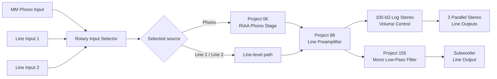

<div align="center">

# High-Fidelity Audio Preamplifier

### Stereo Line Preamplifier • MM Phono Stage • RIAA Equalisation • Subwoofer Low-Pass Output

A standalone analog-audio project covering **circuit selection and adaptation, system integration, PCB development, construction, grounding, troubleshooting, and final hardware implementation**.

[](#)
[](#)
[](#)
[](#)
[](#)
[](#)

**Project by Stamatios Mavitzis**  
**Completed: June 2022**

### [Read the complete technical report](./Pre_Amplifier.pdf)

</div>

---

## Overview

This project is a **standalone stereo analog audio preamplifier** intended for use between analog source equipment and an external power amplifier or other line-level destination.

The completed unit provides:

- one **moving-magnet (MM) phono input** with RIAA playback equalisation;
- two conventional **stereo line-level inputs**;
- four-position rotary source selection, with three positions used;
- a **100 kΩ logarithmic stereo master-volume control**;
- a fixed Project 88 line-stage gain configuration using the **15 kΩ gain-setting option**;
- three **parallel stereo line-output pairs**;
- a separately controlled **mono low-pass subwoofer output**;
- an internal regulated nominal **±15 V analog supply**; and
- a controlled **star-ground / protective-earth chassis-bonding arrangement**.

The project was developed independently as a personal electronics project. It is not associated with, submitted to, or developed on behalf of a university or academic institution.

The repository includes the complete technical report, which documents the circuitry, PCB implementation, grounding, construction, troubleshooting, limitations, and project photographs.

---

## At a Glance

| Category | Final implementation |
|---|---|
| Audio architecture | Stereo analog preamplifier |
| Active inputs | Phono, Line 1, Line 2 |
| Selector | 4 positions; 3 used, 1 spare |
| Phono stage | MM, RIAA playback equalisation |
| Line preamplifier | Elliott Sound Products Project 88 |
| Implemented line-stage gain | 15 kΩ second-stage option only |
| Balance control | **Not fitted; reference balance section bypassed** |
| Master volume | 100 kΩ logarithmic stereo potentiometer |
| Main outputs | 3 parallel stereo line-output pairs |
| Subwoofer output | Adjustable mono low-pass line output |
| Subwoofer filter | ESP Project 155, one mono channel used |
| Calculated subwoofer range | Approx. 20–226 Hz |
| Operational amplifiers | LME49720 dual audio op-amps |
| Analog supply | Nominal regulated ±15 V |
| Transformer | 15-0-15 VAC toroidal, approx. 15 VA |
| Rectifier | Discrete 1N4004 diodes |
| Smoothing capacitors | 4 × 2200 µF |
| Regulators | LM7815 / LM7915 |
| Local decoupling | 10 µF electrolytic + 100 nF ceramic |
| Main PCB | 2-layer, 1.6 mm FR-4, 1 oz copper |
| PCB manufacture | JLCPCB |
| Grounding | Controlled chassis star point |
| RCA connectors | Chassis-mounted but electrically isolated |

> **Measurement note:** the completed unit was functionally tested and used for listening, but no calibrated laboratory measurements of THD/THD+N, SNR, frequency response, RIAA tracking error, crosstalk, clipping level, output impedance, supply ripple, or exact rail voltage were recorded. Numerical performance values in the report are therefore identified as design values, component values, reference data, or theoretical calculations rather than measured specifications.

---

## Signal Architecture



The reference Project 88 balance-control arrangement is **not used** in the completed preamplifier. The balance section is bypassed.

---

## Circuit References

The project integrates and adapts several circuits published by **Rod Elliott / Elliott Sound Products (ESP)**.

| ESP project | Function in the completed preamplifier |
|---|---|
| **Project 05** | Regulated symmetrical power supply |
| **Project 06** | Moving-magnet phono preamplifier and RIAA equalisation |
| **Project 88** | Main line-level preamplifier |
| **Project 155** | Adjustable low-pass filter for the subwoofer output |

These circuits provide the basis for the main functional stages. The PCB organisation, enclosure integration, signal interconnection, grounding arrangement, cable routing, construction, troubleshooting, and final system implementation were developed specifically for this project.

---

## Moving-Magnet Phono Stage

The phono input is based on **ESP Project 06** and is intended for a conventional moving-magnet cartridge.

A phono cartridge produces a much smaller signal than a normal line-level source, so the phono stage provides both:

1. low-noise voltage amplification; and
2. the frequency-dependent **RIAA playback equalisation** required for vinyl reproduction.

The final implementation uses **LME49720** dual operational amplifiers and operates from the same nominal ±15 V supply as the remaining analog circuitry.

Because the phono path handles the smallest signals in the system, short routing, shielding, grounding, and physical separation from the transformer and mains wiring are particularly important.

---

## Line Preamplifier and Volume Control

The main line-level circuitry is based on **ESP Project 88**.

The reference design provides several possible gain settings, but the completed hardware uses **only the 15 kΩ second-stage gain-setting option**. In the Project 88 reference design, this option corresponds to approximately **6.02 dB of second-stage gain**.

The higher-gain options were not required for the associated power amplifier.

The master level is controlled by a **100 kΩ logarithmic stereo potentiometer**.

### Balance control

The Project 88 reference circuit includes an optional balance-control arrangement. This feature was **not implemented** in the completed preamplifier.

The balance section is bypassed, so the front panel provides **no left/right balance adjustment**.

---

## Main Outputs

The completed unit provides **three stereo line-output pairs**.

These outputs are connected in parallel to the same left- and right-channel output signals; they are **not three independently buffered outputs**.

This arrangement is intended for high-impedance line-level destinations such as:

- external power amplifiers;
- active loudspeakers;
- recording equipment;
- headphone amplifiers; or
- other line-level audio equipment.

The outputs are not intended to drive passive loudspeakers directly.

---

## Subwoofer Low-Pass Output

A separate PCB based on the low-pass section of **ESP Project 155** provides the subwoofer function.

The filter PCB contains two independent mono channels, but only **one mono channel** is used in the completed preamplifier.

The three frequency-setting capacitors in the active channel are:

```text
C1 = C2 = C3 = 0.5 µF
```

With the original Project 155 resistor values, this gives a **theoretical** adjustable -3 dB range of approximately:

```text
20 Hz ─────────────── 226 Hz
```

The front panel provides separate controls for:

- subwoofer cut-off frequency; and
- subwoofer output level.

The subwoofer output remains a **line-level signal** and is intended for an active subwoofer or an external subwoofer power amplifier.

> The 20–226 Hz range is calculated from the Project 155 scaling relationship and the installed capacitor values; it was **not measured on the completed hardware**.

---

## Power Supply

The analog circuitry is powered by a regulated symmetrical supply based on **ESP Project 05**.

```text
15-0-15 VAC Toroidal Transformer
              │
              ▼
      Discrete 1N4004 Rectifier
              │
              ▼
      4 × 2200 µF Smoothing
          Capacitors
              │
       ┌──────┴──────┐
       ▼             ▼
     LM7815        LM7915
       │             │
       ▼             ▼
     +15 V          -15 V
       └──────┬──────┘
              ▼
             0 V
```

### Implemented supply hardware

| Component | Implementation |
|---|---|
| Transformer | 15-0-15 VAC toroidal, approx. 15 VA |
| Rectification | Discrete 1N4004 silicon diodes |
| Main smoothing | 4 × 2200 µF electrolytic capacitors |
| Positive regulator | LM7815 |
| Negative regulator | LM7915 |
| Nominal regulated rails | +15 V / 0 V / -15 V |
| Local bypassing | 100 nF ceramic |
| Local decoupling | 10 µF electrolytic |

The exact positive and negative rail voltages were not formally recorded, so **±15 V is treated as the nominal design value rather than a measured specification**.

---

## Grounding and Chassis Bonding

Grounding was treated as part of the analog design rather than simply as a PCB connectivity requirement.

The final arrangement uses a **controlled chassis star point** where the principal circuit-ground system and the protective-earth chassis bond meet.

```text
Audio / Circuit Returns ──────┐
Power-Supply Reference ───────┤
                              ├──► Dedicated Chassis Star Point
Protective Earth ─────────────┤
Metal Chassis ────────────────┘
```

The rear-panel RCA connectors are mechanically mounted to the metal enclosure but are **electrically isolated from the chassis**. Their signal returns are routed through the intended grounding network instead of creating multiple uncontrolled chassis connections.

This arrangement helps reduce unintended parallel return paths and makes the relationship between signal ground, chassis, and protective earth explicit.

---

## PCB Design and Manufacturing

The main schematic was developed in **Autodesk Eagle** and subsequently transferred to **EasyEDA**, where the final PCB layout and manufacturing preparation were completed.

### Main PCB construction

| Property | Value |
|---|---|
| Layers | 2 |
| Material | FR-4 |
| Thickness | 1.6 mm |
| Copper | 1 oz |
| Assembly | Predominantly through-hole |
| Op-amp mounting | Socketed DIP packages |
| Manufacturer | JLCPCB |

The PCB layout was organised with attention to:

- short analog signal paths;
- separation of sensitive audio circuitry from rectifier and transformer wiring;
- compact op-amp feedback networks;
- local supply decoupling;
- controlled ground and return-current paths;
- consistent stereo-channel routing; and
- practical manual assembly and servicing.

---

## Practical Troubleshooting

### Input crosstalk

During early operation, a signal connected to one input could be heard weakly while another input was selected.

The likely mechanism was **parasitic capacitive coupling between adjacent unbalanced signal wires**, especially where conductors ran in parallel over significant distances.

The susceptible wiring was replaced with **coaxial audio cable**, and the internal routing was reorganised. Audible bleed between unselected inputs was substantially reduced.

### Mains-related hum

Audible mains-related hum was also encountered during development.

The hum was identified by listening; it was **not measured with FFT or frequency-domain instrumentation**, so it should not be described as a confirmed 50 Hz measurement.

Improvements included:

- increasing separation between mains-related wiring and low-level signal paths;
- moving sensitive wiring farther from the transformer where practical;
- using coaxial cable where shielding was beneficial;
- electrically isolating the RCA shells from the chassis; and
- consolidating the intended return paths at the chassis star point.

These changes reduced the audible hum during normal use.

### LME49720 decoupling

No audible instability was encountered with the final LME49720 implementation.

Because the LME49720 is a relatively high-bandwidth audio op-amp, local **100 nF ceramic + 10 µF electrolytic** supply decoupling was retained close to the active circuitry.

---

## Final Implemented Configuration

```text
Inputs:
  • 1 × MM phono
  • 2 × stereo line-level
  • 1 unused selector position

Main signal path:
  • Project 06 phono stage
  • Project 88 line preamplifier
  • 15 kΩ gain option only
  • 100 kΩ logarithmic stereo volume control
  • Balance section bypassed
  • 3 parallel stereo line outputs

Subwoofer:
  • Project 155 low-pass section
  • 1 mono channel used
  • C1 = C2 = C3 = 0.5 µF
  • Calculated range ≈ 20–226 Hz

Power:
  • 15-0-15 VAC toroidal transformer
  • 1N4004 rectification
  • 4 × 2200 µF smoothing capacitors
  • LM7815 / LM7915 regulation
  • Nominal ±15 V rails

Active devices:
  • LME49720 dual audio operational amplifiers
```

---

## Development Workflow


---

## Project Scope and Measurement Limitations

This was a practical construction and integration project rather than a calibrated audio-measurement study.

The finished preamplifier was functionally tested and used for listening, but the following were **not formally measured**:

- THD or THD+N;
- signal-to-noise ratio;
- channel separation / crosstalk in dB;
- absolute frequency response;
- RIAA tracking error;
- exact line-stage gain;
- clipping level;
- output impedance;
- power-supply ripple; and
- exact regulated rail voltage.

For that reason, the project documentation intentionally avoids presenting published reference-circuit specifications as measurements of this particular unit.

---

## Repository Documentation

The principal technical document is:

### [`Pre_Amplifier.pdf`](./Pre_Amplifier.pdf)

The report contains:

- system architecture;
- power-supply design and calculations;
- MM phono-stage and RIAA discussion;
- line-preamplifier implementation;
- volume and gain configuration;
- subwoofer low-pass filter;
- grounding and protective-earth arrangement;
- complete circuit schematics;
- PCB construction and implementation;
- hardware and development photographs;
- troubleshooting and noise-reduction work;
- limitations of the evaluation; and
- final conclusions and possible future improvements.

---

## Tools and Manufacturing

| Tool / Service | Use |
|---|---|
| **Autodesk Eagle** | Main schematic development |
| **EasyEDA** | Final PCB layout and fabrication preparation |
| **JLCPCB** | PCB manufacturing |

---

## Skills Demonstrated

This project involved practical work in analog audio electronics, operational-amplifier circuits, RIAA equalisation, linear power supplies, voltage regulation, schematic capture, PCB layout, through-hole assembly, soldering, grounding, shielded audio wiring, EMI/crosstalk reduction, enclosure integration, qualitative troubleshooting, and system-level hardware implementation.

---

## Acknowledgements

Special acknowledgement is given to **Rod Elliott and Elliott Sound Products** for publishing the reference circuits and technical material used as the basis for several sections of the preamplifier.

I would also like to thank **Chevas Lukas** for his valuable help, support, and practical assistance during the development of the project.

---

<div align="center">

## Author

**Stamatios Mavitzis**  
Independent Engineering Project  
Project completed: **June 2022**

---

*Analog audio • PCB development • grounding • construction • troubleshooting*

</div>
